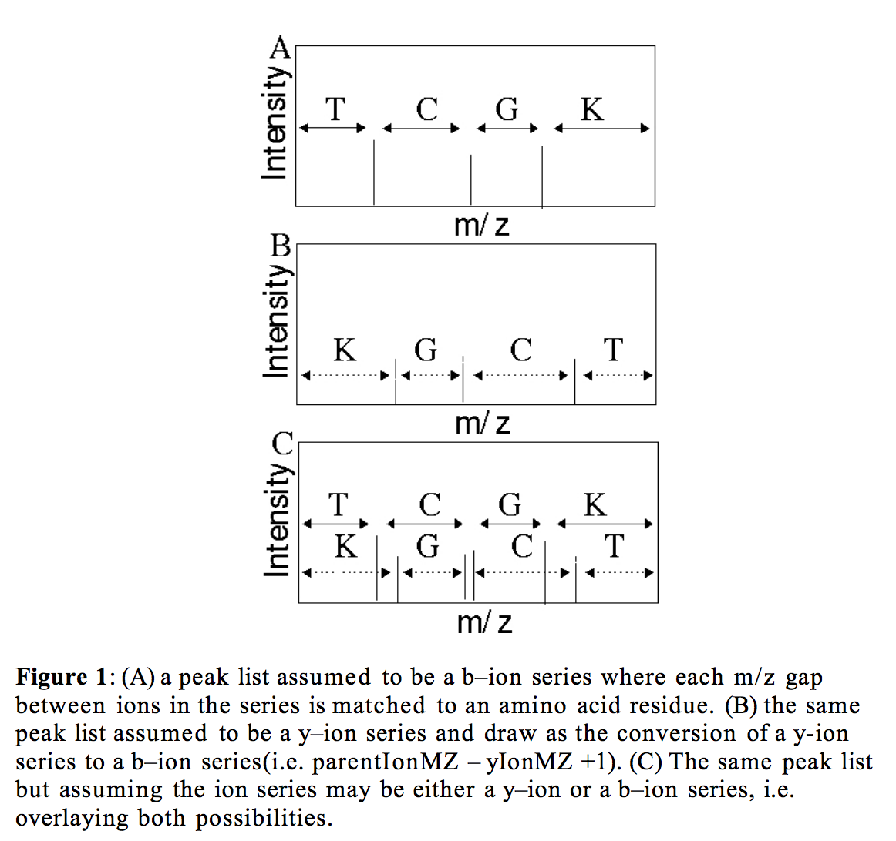

MS/MS Peptide Finite State Machine (PFSM)
====

This repository contains the source-code for the Peptide Finite State Machine (PFSM) algorithm described in a [manuscript](Bioinformatics-2005-Falkner-bioinformatics-bti362.pdf) published during my PhD studies at the University of Michigan. 

>### Fast tandem mass spectra–based protein identification regardless of the number of spectra or potential modifications examined.
Jayson Falkner and Philip Andrews †
†Dept. of Biological Chemistry and Program in Bioinformatics , University of
Michigan, 1301 Catherine St., Ann Arbor, MI 48109

>#### Abstract
**Motivation:** Comparing tandem mass spectra (MSMS) against a known data set
of protein sequences is a common method for identifying unknown proteins;
however, the processing of tandem mass spectra by current software often
limits certain applications, including comprehensive coverage of post–
translational modifications, non–specific searches, and real–time searches to
allow result–dependent instrument control. This problem deserves attention as
new mass spectrometers provide the ability for higher throughput and as
known protein data sets rapidly grow in size. New software algorithms need to
be devised in order to address the performance issues of conventional MSMS
protein data set–based protein identification.

I've described this manuscript several times and often to people familiar with CS but not science and proteomics. An easy way to describe this in CS terms is that I implemented a regular expression based on masses in a tandem mass spectrum (MS/MS) instead of letters in an alphabet. The net benefit is that, like a regular expression, you can multiplex an arbitrary number of words (spectra in this case) and it searches in the same amount of time. 

If you aren't a science or CS person, then the explaination goes like this. Protein analysis makes a few thousand scans per run. Modern software searches one at a time, which can take a long time. This algorithm searches everything in the same amount of time it takes to search one thing. It is really fast. Magic.

### How the algorithm works

Here is a summary of how the algorithm works based on the images in the manuscript.

First, consider that a tandem mass spectrum is based on a alphabet (amino acids). It is slightly confusing because the same word is repeated both forward and backward, but still just letters from an alphabet.

Next note that words are actually peptides. The amino acids that make up the peptide occasionally have combinations that end up ambiguous if you are working with spectrum masses. The solution is to consider all possibilities -- don't assume one is correct.

Another form of the ambiguous combination problem is cases where a spectrum lacks an expected peak. In these cases you must use multiple amino acids to fill the gap. If doing this, all permutations of the amino acids need be considered.

Once all spectra have been converted to graphs (NDFA) they can then be linked together as a single NDFA. This isn't yet helpful beyond setting us up for conversion of the NDFA to a single DFA that runs remarkably quickly.

Finally, the key step to getting fast performance. Conversion of NDFA to DFA. In other words, converting the graph(s) to a single state machine where for every state exactly one transition exists for every letter in the alphabet. Interestingly, this works the same if you are converting one word (a spectrum) or many (entire set of spectra).

Performance of testing this manuscript's implementation against real MS/MS data sets. It works and can handle lots of post translational modifications!

